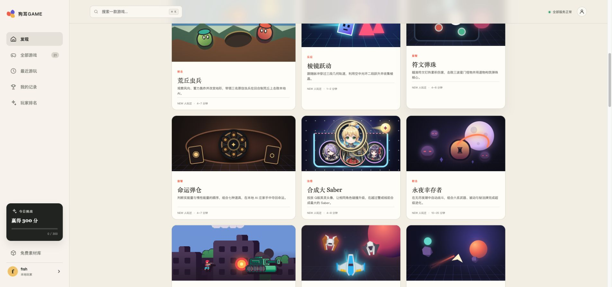
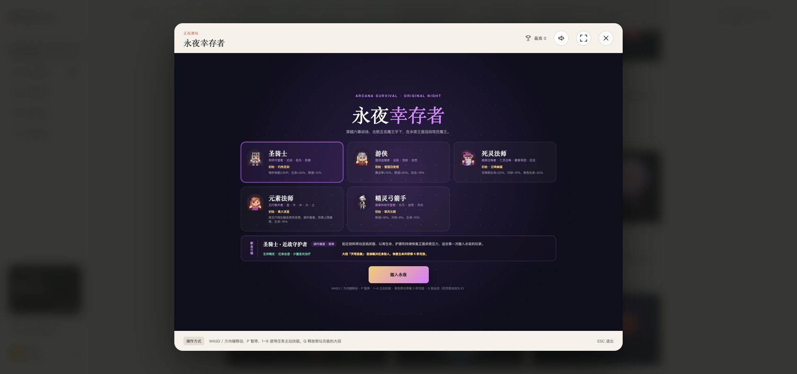
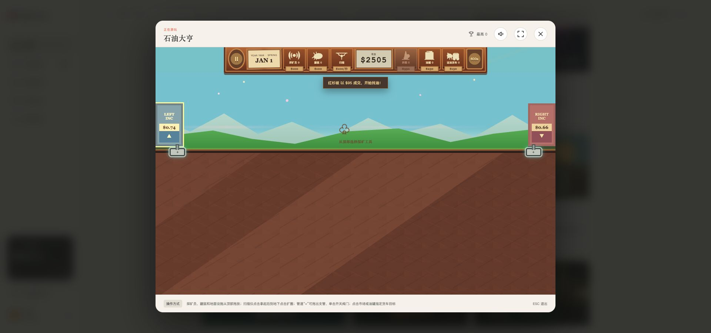
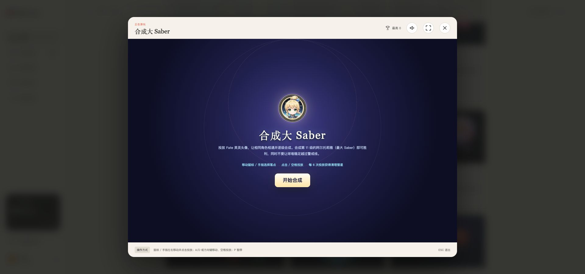
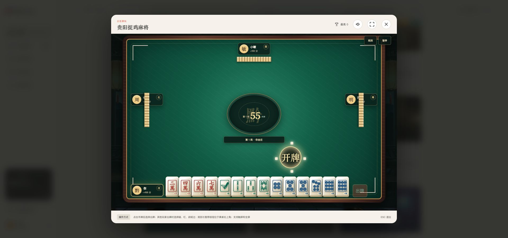
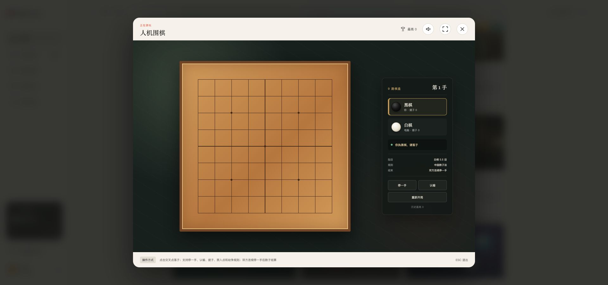

# 狗耳GAME

`ac-game` 是一个基于 Next.js、React、Three.js 构建的网页游戏平台。玩家以本地游客身份进入大厅，可以直接游玩动作、益智、音乐、经营和休闲类小游戏，并在浏览器中保存最高分与排行榜数据。

**在线游玩：** [https://game.acgay.cn](https://game.acgay.cn)

<p align="center">
  <a href="https://game.acgay.cn">
    
  </a>
</p>

## 游戏截图

<table>
  <tr>
    <td width="50%"><strong>永夜幸存者</strong><br></td>
    <td width="50%"><strong>石油大亨</strong><br></td>
  </tr>
  <tr>
    <td width="50%"><strong>合成大 Saber</strong><br></td>
    <td width="50%"><strong>贵阳捉鸡麻将</strong><br></td>
  </tr>
  <tr>
    <td colspan="2"><strong>人机围棋</strong><br></td>
  </tr>
</table>

## 当前能力

- 统一游戏大厅、分类、搜索、最近游玩和排行榜。
- 本地游客用户名、成绩存储和全局静音。
- 游戏全屏、暂停、操作说明和响应式布局。
- 多款独立分层小游戏，包括贵阳捉鸡麻将、永夜幸存者、石油大亨、合成大 Saber、围棋、祖玛等。
- Docker standalone 镜像、Kubernetes 清单和 Woodpecker 自动构建发布流程。

## 技术栈

- Next.js 16
- React 19
- TypeScript 5
- Three.js / React Three Fiber
- Web Audio API

## 本地开发

环境要求：Node.js 24、npm。

```bash
npm ci
npm run dev
```

开发地址：<http://localhost:4399/>

## 检查与构建

```bash
npm run lint -- --max-warnings=0
npm test
npm run build
npm run start
```

健康检查：<http://localhost:4399/api/health>

## 目录结构

```text
app/                 Next.js 页面、全局样式与健康接口
components/          公共 UI 组件
config/              游戏注册信息
features/games/      各游戏独立实现
features/hub/        游戏大厅
lib/game-sdk/        游客身份、存储、排行与公共 SDK
public/assets/       游戏素材
docs/                游戏制作规范
```

## 容器与部署

本地构建容器：

```bash
docker build -t ac-game:local .
docker run --rm -p 4399:4399 ac-game:local
```

Kubernetes 配置位于 `k8s.yaml`，默认提供：

- Deployment：`ac-game`
- Service：`ac-game-service`
- 容器端口：`4399`
- NodePort：`30399`
- 健康探针：`/api/health`

首次创建资源时执行：

```bash
kubectl apply -f k8s.yaml
```

`.woodpecker.yml` 会在 `master` 分支推送或创建标签时执行代码检查、镜像构建、推送和 Deployment 滚动更新。仓库中不保存镜像仓库凭据、Kubeconfig、访问令牌或业务密钥，这些信息应由 Woodpecker Secrets 和运行环境提供。

Woodpecker 需要配置以下仓库 Secrets：

- `ghcr_username`：具有 GHCR 推送权限的 GitHub 用户名。
- `ghcr_token`：具有 `write:packages` 权限的令牌。

流水线将镜像推送至 `ghcr.io/fishcg/ac-game`。如果该镜像包不是公开包，部署前还需要在目标命名空间创建名为 `ghcr-pull-secret` 的镜像拉取 Secret；Secret 内容不得提交到仓库。

## 素材

项目使用自制素材、AI 生成素材和允许再分发的免费素材。新增素材时需同时记录来源、作者和许可证，并遵循 `docs/GAME_DEVELOPMENT_STANDARD.md` 中的素材规范。

## 授权与版权

Copyright (c) 2026 ac-game contributors.

- 项目源代码采用 [MIT License](LICENSE)，允许个人及商业项目使用、修改、分发和再授权，但需保留版权与许可声明。
- 项目自制且不包含第三方知识产权的美术和音频素材允许用于商业项目；AI 生成素材还需遵守对应生成服务的使用条款。
- Kenney 与 LordNeo 素材采用 CC0；DawnLike 衍生素材采用 CC BY 4.0；16Pixel 素材采用 CC BY-SA 4.0。使用时必须遵循各素材目录中的 `LICENSE.txt`，履行署名及相同方式共享等要求。
- Fate、Saber 等角色名称、形象、商标及其他第三方知识产权归原权利人所有，不包含在本项目的 MIT 商用授权中。商业发行前必须替换相关素材或取得权利人的明确授权。
- MIT License 不授予“狗耳GAME”名称、标识或任何第三方商标的使用权。
